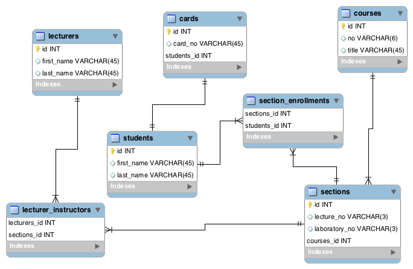

# php-orm-101

## Installation

```
php composer.phar install
```

## Schema diagram



## References

* [Eloquent: Getting Started](https://laravel.com/docs/5.5/eloquent)
* [Eloquent: Relationships](https://laravel.com/docs/5.5/eloquent-relationships)